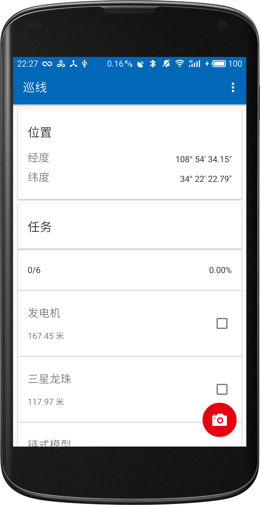
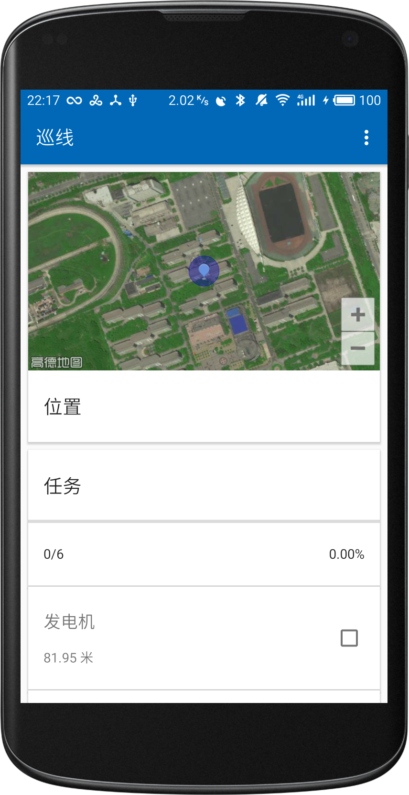
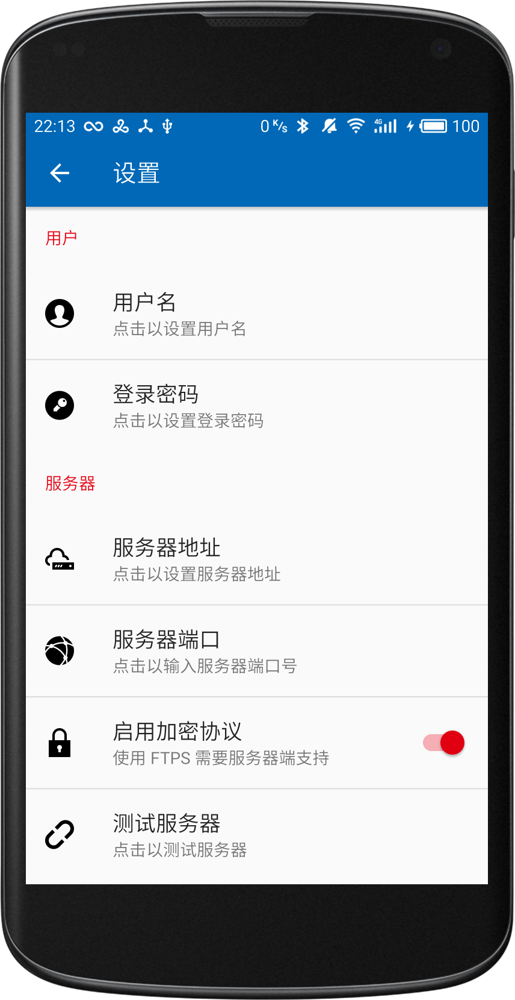

<a href="https://github.com/lucka-me/PatroLine"><div align=center></div></a>

<h1 align=center>软件说明书</h1>

## 目录
* [概述](#系统需求)
    * [运行要求](#运行要求)
        * [已经过测试的设备](#已经过测试的设备)
    * [开发环境](#开发环境)
* [用户界面设计](#用户界面设计)
    * [主界面](#主界面)
    * [设置界面](#设置界面)
* [使用流程](#使用流程)
    * [首次运行](#首次运行)
    * [发布任务（服务器端）](#发布任务（服务器端）)
    * [获取任务](#获取任务)
    * [巡查](#巡查)
    * [报告问题](#报告问题)
* [第三方组件列表](#第三方组件列表)
* [参考资料](#参考资料)

## 概述
基于 Android 平台的线路巡查软件，主要功能包括从服务器获取任务、巡查检查点、提交问题报告及生成、上传任务日志等。

### 运行要求
* Android 5.0 或更高
* 互联网连接
* GNSS 定位模块
* 摄像头

#### 已经过测试的设备
| 设备型号 | 系统版本 |
| :---: | :---:
| 华为 G7 Plus | Android 6.0.1<br/>EMUI 4.0.2
| 魅族 MX4 Pro | Android 5.1.1<br/>Flyme 6.3.0.2A

### 开发环境
* 集成开发环境：Android Studio 3.0
* 主要开发语言：Kotlin

## 用户界面设计
本软件界面简洁，主要包括主界面和设置界面，均采用标准的 Material Design 风格设计。

| 主界面（未显示地图） | 主界面（显示地图） | 设置界面（部分）
| :---: | :---: | :---: |
|  |  | 

### 主界面
软件主界面由工具栏、悬浮按钮、RecyclerView 及各种卡片组成。其中卡片分为以下三种：
* **位置卡片**  
  始终显示。卡片内显示设备当前所在的经纬度或地图。
* **任务卡片**  
  仅在开始载入任务、任务正在进行时显示。当正在载入任务时卡片内显示载入动画；当任务正在进行时则显示任务进度，点击卡片将打开显示任务详情的对话框。
* **检查点卡片**  
  仅在任务正在进行时显示。卡片内显示检查点名称、距离和完成状态，点击卡片将打开显示检查点详情的对话框。

悬浮按钮会在任务开始后显示，点击它将打开系统相机软件，用户可对出现问题的现场拍照，完成拍照后将打开报告对话框，用户可添加问题描述并提交报告，上传期间悬浮按钮会显示上传状态。

### 设置界面
包括对软件各项参数的设置，包括以下项目：
* 用户名
* 服务器登录密码
* 服务器地址
* 服务器端口号
* 是否启用加密协议（FTPS）
* 测试服务器
* 是否显示地图
* 地图类型

## 使用流程
### 首次运行
**针对 Android 6.0 或更高版本的设备：本软件首次运行时将请求位置权限，用户应同意授权，否则软件将无法正确运行。**

首次运行软件时应在设置界面中按系统管理员的要求设置用户名和密码、服务器地址、端口号和加密协议并测试服务器，若测试失败请联系系统管理员。

### 发布任务（服务器端）
系统管理员应在 FTP 服务器的 `Mission` 文件夹下建立名为 `<用户名>.json` 的 JSON 文件，其内容格式参照如下：
```json
{
    "id": "M004267",
    "description": "任务描述"
}
```

随后在 `Mission/GPX` 文件夹下建立名为 `<任务 ID>.gpx` 的 GPX 文件，其内容格式参照如下：
```xml
<gpx>
    <metadata>
        ...
    </metadata>

    <wpt lat="22.53752114" lon="114.1111010">
        <name>检查点名称</name>
        <desc>检查点描述</desc>
    </wpt>

    <wpt lat="22.53584643" lon="114.1112941">
        <name>检查点名称</name>
        <desc>注意事项：<br/> 1.注意事项之一 <br/> 2. 注意事项之二</desc>
    </wpt>
    ...
</gpx>
```
其中坐标必须为 GCJ-02 坐标系下的坐标，文件编码应为 UTF-8。

最后在根目录下建立 `<用户名>/<任务 ID>/` 文件夹供用户上传照片、报告和日志。

### 获取任务
用户在主页面菜单中点击「开始」，软件随即登录服务器下载并解析文件，若遇到错误请联系系统管理员。

### 巡查
本应用会以一定频率更新位置信息，用户应保持设备有良好的 GPS 信号（暂不支持通过网络定位）。在接近检查点时将弹出提示框提示用户检查，用户可选择正常或报告，两者均视为检查完毕，后者将打开相机进入报告问题的流程。  
若软件未弹出提示框，用户也可点击相应的检查点卡片以完成检查。  
任务进行时的位置更新、检查操作和提交报告均会被录入日志文件。

### 报告问题
用户在发现问题时可随时点击界面右下角的悬浮按钮打开系统照相机拍照，确认照片后将返回本软件页面并显示问题报告对话框，用户可添加问题描述并提交报告，软件将生成和上传报告文件 `ISS_<任务 ID>_<报告序列号>.txt` 和照片。

### 停止任务
当全部检查点均检查完毕后，任务对话框将弹出，用户可以选择结束任务。结束任务时软件将生成并上传任务日志文件 `<任务 ID>.log`。用户亦可随时在主页面菜单及任务对话框中结束任务。

## 第三方组件列表
本软件使用了大量第三方组件，大部分开放源代码且通过 Apache License 2.0 授权。

| 组件名称 | 描述
| :--- | :---
| [Apache Commons Net](https://commons.apache.org/proper/commons-net/) | Apache 软件基金会旗下的网络工具和协议库，本软件通过它的组件访问 FTP 服务器
| [Gson](https://github.com/google/gson) | Google 开发的 JSON 解析器库，本软件通过它解析 JSON 文件
| [Anko](https://github.com/Kotlin/anko) | Kotlin 为 Android 开发提供的插件，本软件的网络功能通过它来管理线程
| [Support Library](https://developer.android.com/topic/libraries/support-library/index.html) | Google 提供的支持库，提供了大量新特性如 CardView，并保证了旧 Android 版本的兼容性
| [Android Support Preference V7 Fix](https://github.com/Gericop/Android-Support-Preference-V7-Fix) | 开发者基于官方支持库开发的首选项支持库，修复了官方支持库中存在的一些问题
| [FABProgressCircle](https://github.com/JorgeCastilloPrz/FABProgressCircle) | 符合 Material Design 规范的，与浮动按钮配套使用的加载环
| [iconmonstr](https://iconmonstr.com) | 一套图标
| [高德开放平台](http://lbs.amap.com) | 本软件的地图功能和坐标系转换功能由高德的 API 提供

## 参考资料
在本软件的开发过程中，来自互联网的教程、讨论和示例代码提供了巨大的帮助。

* [FloatingActionButton hide on list scroll | Stack Overflow](https://stackoverflow.com/questions/31617398/)
* [在我们的App中实现一个例子 | 《Kotlin for Android》中文翻译](https://wangjiegulu.gitbooks.io/kotlin-for-android-developers-zh/zai_wo_men_de_app_zhong_shi_xian_yi_ge_li_zi.html)  
  用 `object` 直接定义一个监听器
* [在运行时请求权限 | Android Developers](https://developer.android.com/training/permissions/requesting.html#perm-request)
* [How to programmatically open the Permission Screen for a specific app on Android Marshmallow? | Stack Overflow](https://stackoverflow.com/questions/32822101/)
* [Android动态修改ToolBar的Menu菜单 | CSDN 博客](http://blog.csdn.net/q4878802/article/details/51160424)
* [Taking Photos | Android Developers](https://developer.android.com/training/camera/photobasics.html)  
  调用系统相机照相并获取全分辨率照片
* [ftp-upload/Main.kt | GitHub](https://github.com/KoFuk/ftp-upload/blob/master/src/main/kotlin/com/chronoscoper/ftpupload/Main.kt)  
  示例代码，通过 Apache Commons Net API 连接 FTP 服务器
* [Java Client using FTP over SSL (Explicit) | Java and Open Source](http://www.kochnielsen.dk/kurt/blog/?p=162)  
  示例代码，通过 SSL/TLS 连接 FTPS 时必须设置保护缓冲和数据保护
* [Java FTP file download tutorial and example | Code Java](http://www.codejava.net/java-se/networking/ftp/java-ftp-file-download-tutorial-and-example)
* [保存文件 | Android Developers](https://developer.android.com/training/basics/data-storage/files.html)
* [Android 进阶6：两种序列化方式 Serializable 和 Parcelable | CSDN 博客](http://blog.csdn.net/u011240877/article/details/72455715)  
  将数据序列化保存进文件/从文件中反序列化读取数据
* [GPX 1.1 Schema Documentation | TopoGrafix](http://www.topografix.com/GPX/1/1/#type_trkType)  
  GPX 格式文档
* [设置 | Android Developers](https://developer.android.com/guide/topics/ui/settings.html)
* [Android：详解如何创建Google风格的SettingsActivity | 简书](https://www.jianshu.com/p/f5f8834ee9af)
* [Providing Up Navigation | Android Developers](https://developer.android.com/training/implementing-navigation/ancestral.html)  
  点击工具栏返回时调用 `onBackPress()` 而非 `finish()` 以实现正确的动画效果
* [Building an Android Settings Screen (Part 1) | Medium](https://medium.com/@JakobUlbrich/building-a-settings-screen-for-android-part-1-5959aa49337c)  
  使用 `PreferenceFragmentCompact`
* [创建 Android 设置界面 (第一部分) | 泡在网上的日子](http://www.jcodecraeer.com/a/anzhuokaifa/androidkaifa/2017/0502/7901.html)  
  上文的翻译
* [onPreferenceClick listener not working / onPreferenceClick not being called | Stack Overflow](https://stackoverflow.com/questions/18588670/)  
  处理设置界面的点击事件
* [How to add a simple 8dp header/footer to Android's RecyclerView? | Stack Overflow](https://stackoverflow.com/questions/28998327/)  
  用 `clipToPadding` 避免视图物件在 Padding 内部绘制
* [Android ImageView 图片靠右，靠左处理 | CSDN 博客](http://blog.csdn.net/thinan/article/details/51729445)
* [Android preferences onclick event | Stack Overflow](https://stackoverflow.com/questions/5330677/)  
  在设置页面里通过 `<intent>` 点击打开新页面
